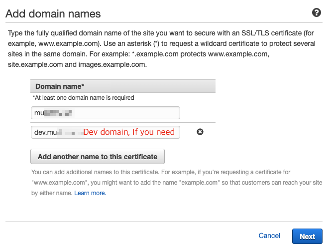
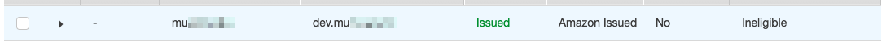

# Installation Guide

## Install Nuxt

Set up a Nuxt project first. It can also be installed on Nuxt projects already in use.

[Nuxt Official : Installation](https://nuxtjs.org/guide/installation/)

## Install Packages

Install packages in the project directory.

```bash
cd my-nuxt-project
npm i nuxt-aws-lambda
npm i serverless serverless-nuxt-plugin serverless-apigw-binary serverless-domain-manager -D
```

Install `nuxt-start` and install `nuxt` again as a dev package. No build-related packages are required when running on Lambda. And It reduce the package size to be uploaded to Lambda. ([Max package size is 250MB.](https://docs.aws.amazon.com/lambda/latest/dg/gettingstarted-limits.html))

```bash
npm i nuxt-start
npm i nuxt -D
```

Install the `env-cmd` package to set environment variables.

```bash
npm i env-cmd -D
```

## Domain Settings

Nuxt does not support the form of the API Gateway URL(`https://***.execute-api.ap-southeast-2.amazonaws.com/dev`). You must remove the default path (`/dev`) included after the URL. To do this, you connect your domain to API Gatway. Use the pre-installed `serverless-domain-manager` package.

Get a certificate using AWS ACM. Regions must be set to "US East 1"(N Virginia, us-east-1).

https://console.aws.amazon.com/acm/home?region=us-east-1#/



Wait 5 minutes and the **Status** changes to **Issued**. Once you confirm that it has been changed to **Issued**, proceed to the next step.



## Create Files

Create a `.env-cmdrc.js` file.

```js
module.exports = {
  local: {
    NODE_ENV: 'development',
    PORT: '8080',

    // API_URL: 'https://api.dev.my-nuxt-project.com', // If you are using the `@nuxtjs/axios` package, you need to set environment variables.
  },
  prod: {
    DOMAIN_NAME: 'my-nuxt-project.com', // Enter the domain created above.
    NODE_ENV: 'production',
    NUXT_TELEMETRY_DISABLED: '1',

    // API_URL: 'https://api.my-nuxt-project.com', // If you are using the `@nuxtjs/axios` package, you need to set environment variables.
  },
}
```

Check the `package.json` file. Never mind the dependencies version.

```json
{
  "name": "my-nuxt-project",
  "version": "0.0.0",
  "private": true,
  "scripts": {
    "dev": "env-cmd -e local nuxt",
    "deploy": "env-cmd -e prod sls deploy --stage prod"
  },
  "dependencies": {
    "nuxt-start": "^2.11.0",
    "nuxt-aws-lambda": "^1"
  },
  "devDependencies": {
    "env-cmd": "^10.1.0",
    "nuxt": "^2.11.0",
    "serverless": "^1.67.0",
    "serverless-apigw-binary": "^0.4.4",
    "serverless-domain-manager": "^3.3.1",
    "serverless-nuxt-plugin": "^1"
  }
}
```

Create a `serverless.yml` file. Use the Cloud Formations to upload **assets**(`.nuxt/dist/client`) files to the **AWS S3** bucket. If you have an S3 bucket already created, remove Cloud Formation information(**resources** section).

Write your plugin settings in the `custom.nuxt` field. The version(`custom.nuxt.version`) is used as a prefix when uploading assets files to S3.

```yml
service: my-nuxt-project # your project name

plugins:
  - serverless-nuxt-plugin
  - serverless-apigw-binary
  - serverless-domain-manager

provider:
  name: aws
  region: ap-northeast-2 # Region to use
  stage: ${opt:stage, 'dev'}
  runtime: nodejs12.x
  environment:
    NODE_ENV: ${env:NODE_ENV}
    # API_URL: ${env:API_URL} # If you are using the `@nuxtjs/axios` package, you need to set environment variables.

custom:
  customDomain:
    domainName: ${env:DOMAIN_NAME}
  apigwBinary:
    types:
      - 'image/*'
  nuxt:
    version: v${file(./package.json):version}
    bucketName: my-nuxt-project-${self:provider.stage} # Asset Path https://my-nuxt-project-prod.s3.amazonaws.com/v1.3.1/

resources:
  Resources:
    AssetsBucket:
      Type: AWS::S3::Bucket
      Properties:
        BucketName: ${self:custom.nuxt.bucketName}
        CorsConfiguration:
          CorsRules:
            - AllowedMethods:
              - GET
              - HEAD
              AllowedOrigins:
              - https://${env:DOMAIN_NAME}

functions:
  nuxt:
    memorySize: 2048
    timeout: 30
    handler: handler.render
    events:
      # lambda warmer
      # - schedule: rate(5 minutes)
      - http: ANY /
      - http: ANY /{proxy+}
```

You can modify the existing Nuxt configuration file (`nuxt.config.js`) to fit the following format:

```js
// Change "export default" => "module.exports ="
module.exports = {
  target: 'server',
  head: {
    /* ... */
  },
  build: {
    // The "publicPath" value is automatically generated by the serverless-nuxt plug-in
    publicPath: process.env.SERVERLESS_NUXT_PUBLIC_PATH,
  },
}
```

Finally, the handler(`handler.js`) is written as:

```js
const { createNuxtHandler } = require('nuxt-aws-lambda')
const config = require('./nuxt.config.js')

module.exports.render = createNuxtHandler(config)
```

## Deploy

Now let's upload the project to AWS.

Create a domain. You only need to do this once when creating a project.

```bash
npx env-cmd -e prod sls create_domain
```

Deploy your project to AWS Lambda using serverless.

```bash
npm run deploy
```

## Deploy without Build

```bash
SERVERLESS_NUXT_SKIP_BUILD=1 npm run deploy
```
